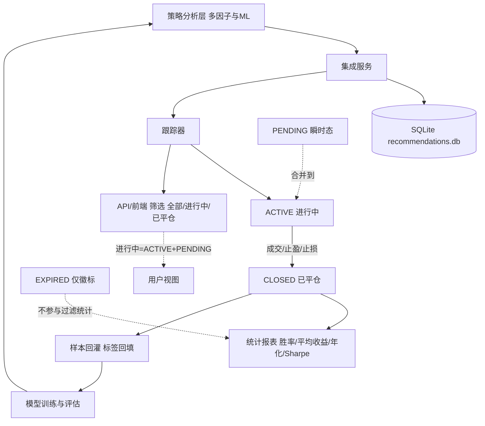
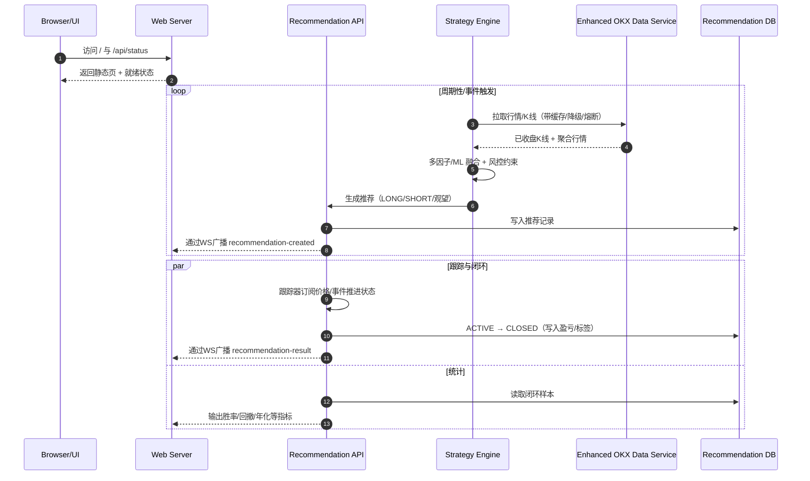
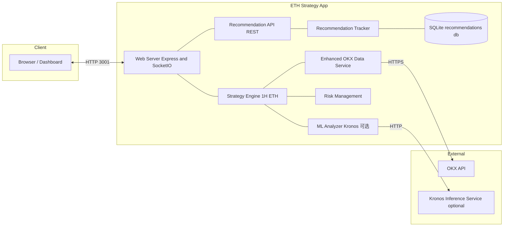

# ETH合约策略分析系统

🚀 专注 ETH 合约做多/做空的短期（1H）高胜率策略平台，集成机器学习大模型的智能分析

系统主要提供：围绕 ETH 合约在 1 小时周期（1H）上的高胜率策略与交易信号输出，支持双向（做多/做空）操作。

## 目录
- [功能特性](#功能特性)
- [系统核心逻辑（从信号到闭环）](#系统核心逻辑从信号到闭环)
- [快速开始](#快速开始)
- [使用指南](#使用指南)
- [API接口](#api接口)
- [配置说明](#配置说明)
- [开发指南](#开发指南)
- [注意事项](#注意事项)
- [免责声明](#免责声明)
- [系统结构与运行步骤总览](#系统结构与运行步骤总览)
- [组件与部署拓扑（对外简图）](#组件与部署拓扑对外简图)

## 功能特性

### 🧠 机器学习分析
- **OpenAI GPT集成**: 利用大语言模型进行市场情绪和新闻分析
- **Hugging Face模型**: 集成专业的金融分析模型
- **TensorFlow.js**: 本地机器学习模型训练和预测
- **多因子分析**: 结合技术指标和ML分析的智能信号生成

### 📊 技术指标分析
- **RSI**: 相对强弱指数分析
- **MACD**: 移动平均收敛发散指标
- **布林带**: 价格波动区间分析
- **KDJ**: 随机指标分析
- **Williams %R**: 威廉指标
- **EMA/SMA**: 指数/简单移动平均线

### 🎯 智能交易信号
- **多时间框架分析**: 以 1H 为核心的 15m/1H/4H/1D 多周期综合确认
- **信号强度评估**: 基于置信度的信号分级
- **风险评估**: 实时风险评分和预警
- **目标价格预测**: AI驱动的价格目标计算

### 🛡️ 风险管理
- **动态止损**: 基于波动率的智能止损
- **仓位管理**: 自动仓位大小计算
- **最大回撤控制**: 实时监控和保护
- **日损失限制**: 防止过度亏损

### 🌐 Web界面
- **实时仪表板**: 美观的实时数据展示
- **WebSocket推送**: 实时策略更新
- **交互式图表**: 价格走势和指标可视化
- **移动端适配**: 响应式设计支持移动设备

## 系统核心逻辑（从信号到闭环）




- 核心目标与口径：系统全自动闭环，无需人工确认；对外仅两种状态——进行中（ACTIVE）与已平仓（CLOSED）。历史兼容状态（如 PENDING/EXPIRED）已并入上述口径，不对外暴露或筛选，前端“进行中”已覆盖任何瞬时待确认态。

- 数据流与职责分工：
  1) 策略/分析层生成推荐（结合多因子与ML）；
  2) 集成服务写入推荐记录并触发跟踪；
  3) 跟踪器接管生命周期，负责状态流转、持久化与对前端推送。
  相关代码：<mcfile name="recommendation-integration-service.ts" path="src/services/recommendation-integration-service.ts"></mcfile>、<mcfile name="recommendation-tracker.ts" path="src/services/recommendation-tracker.ts"></mcfile>

- 状态模型与转换：
  • 进行中（ACTIVE）：新推荐直接进入主路径进行跟踪与风控；
  • 已平仓（CLOSED）：由成交/止盈/止损等闭环事件触发，写入盈亏并计入统计；
  • 历史兼容态（PENDING/EXPIRED）：仅内部与历史数据兼容用，PENDING 视为进行中口径，EXPIRED 仅作为质量标识，不提供独立过滤；
  • 前端筛选口径：下拉框仅保留“全部状态 / 进行中 / 已平仓”，其中“进行中”合并任何瞬时待确认。

- 持久化与一致性：
  • 数据库存储于 data/recommendations.db（SQLite）；
  • 统一通过跟踪器写入/更新，确保状态一致性（避免旁路写入造成分叉）；
  • 历史默认值若为 PENDING，将在跟踪接管后落入 ACTIVE 主路径；平仓时落 CLOSED 并记录收益。

- 统计与口径：
  • 胜率、平均收益等仅按“已平仓（CLOSED）”样本计算；进行中不计入；
  • 短样本保护：当样本窗口<30天或已平仓交易<10笔时，年化收益与 Sharpe 比率显示为 N/A，避免误导；
  • 指标计算不受“PENDING/EXPIRED”影响（因已并口径化）。

- API 与前端：
  • 列表过滤项仅“全部 / 进行中 / 已平仓”；
  • 若启用“已过期”徽标，仅作为历史质量标记，不影响过滤与统计；
  • 进行中包含任何瞬时待确认态，保障“无人工确认”的产品心智。

- 机器学习样本闭环：
  • 已平仓样本回填标签进入样本库供训练与评估；
  • pending label samples 指“待回填标签的训练样本”，与订单状态无关。

## 快速开始

### 环境要求
- Node.js >= 18.0.0
- npm >= 8.0.0
- 稳定的网络连接（访问OKX API）

### 安装步骤

1. **克隆项目**
```bash
git clone <repository-url>
cd ETH
```

2. **安装依赖**
```bash
npm install
```

3. **配置环境变量**
```bash
cp .env.example .env
```

编辑 `.env` 文件，配置以下必要参数：

```env
# OKX API配置
OKX_API_KEY=your_okx_api_key
OKX_SECRET_KEY=your_okx_secret_key
OKX_PASSPHRASE=your_okx_passphrase

# 机器学习API配置
OPENAI_API_KEY=your_openai_api_key
HUGGINGFACE_API_KEY=your_huggingface_api_key

# 策略配置
USE_ML_ANALYSIS=true
ML_CONFIDENCE_THRESHOLD=0.7

# 风险管理
MAX_DAILY_LOSS=5.0
STOP_LOSS_PERCENT=2.0
TAKE_PROFIT_PERCENT=4.0
```

4. **启动应用**
```bash
npm start
```

5. **访问Web界面**
打开浏览器访问: http://localhost:3000

## 使用指南

### 启动策略
1. 确保配置正确
2. 在Web界面点击"启动策略"按钮
3. 系统将开始实时分析市场数据
4. 根据分析结果生成交易信号

### 监控系统
- **系统状态**: 查看策略引擎和连接状态
- **市场数据**: 实时ETH价格和市场指标
- **交易信号**: 当前信号类型、强度和置信度
- **持仓信息**: 当前持仓状态和盈亏
- **性能统计**: 历史交易表现和风险指标

### API接口

系统提供完整的REST API接口：

```bash
# 获取策略状态
GET /api/strategy/status

# 启动/停止策略
POST /api/strategy/start
POST /api/strategy/stop

# 获取市场数据
GET /api/market/ticker
GET /api/market/kline?interval=1m&limit=100

# 获取分析结果
GET /api/strategy/analysis
GET /api/indicators/latest

# 获取交易历史
GET /api/strategy/trades?limit=50
```

## 配置说明

### 交易配置
- `DEFAULT_SYMBOL`: 默认交易标的 (ETH-USDT-SWAP)
- `MAX_LEVERAGE`: 最大杠杆倍数
- `MAX_POSITIONS`: 最大同时持仓数量

### 技术指标参数
- `RSI_PERIOD`: RSI计算周期 (默认14)
- `MACD_FAST/SLOW/SIGNAL`: MACD参数 (12,26,9)
- `BOLLINGER_PERIOD/STD`: 布林带参数 (20,2)

### 机器学习配置
- `USE_ML_ANALYSIS`: 是否启用ML分析
- `ML_CONFIDENCE_THRESHOLD`: ML分析置信度阈值
- `ML_MODEL_PATH`: 本地模型文件路径

### 风险管理
- `MAX_DAILY_LOSS`: 最大日亏损百分比
- `MAX_POSITION_SIZE`: 最大单笔仓位大小
- `STOP_LOSS_PERCENT`: 止损百分比
- `TAKE_PROFIT_PERCENT`: 止盈百分比

## 开发指南

### 项目结构
```
src/
├── analyzers/          # 信号分析器
│   └── smart-signal-analyzer.ts
├── config.ts           # 配置管理
├── indicators/         # 技术指标
│   └── technical-indicators.ts
├── ml/                 # 机器学习模块
│   └── ml-analyzer.ts
├── server/             # Web服务器
│   └── web-server.ts
├── services/           # 数据服务
│   └── okx-data-service.ts
├── strategy/           # 策略引擎
│   └── eth-strategy-engine.ts
└── app.ts              # 应用入口
```

### 添加新的技术指标
1. 在 `src/indicators/technical-indicators.ts` 中添加计算方法
2. 在 `SmartSignalAnalyzer` 中集成新指标
3. 更新配置文件添加相关参数

### 集成新的ML模型
1. 在 `src/ml/ml-analyzer.ts` 中添加模型接口
2. 实现模型的训练和预测方法
3. 在策略引擎中调用新模型

### 自定义交易策略
1. 继承或修改 `ETHStrategyEngine` 类
2. 实现自定义的信号生成逻辑
3. 添加相应的风险管理规则

## 注意事项

### 安全提醒
- 🔐 妥善保管API密钥，不要提交到版本控制
- 💰 建议先在测试环境验证策略效果
- 📊 定期监控系统运行状态和资金安全
- ⚠️ 机器学习分析仅供参考，不构成投资建议

### 性能优化
- 🚀 使用代理服务器提高API访问速度
- 💾 合理设置缓存时间减少API调用
- 🔄 定期清理历史数据避免内存泄漏

### 故障排除

**常见问题：**

1. **API连接失败**
   - 检查网络连接和代理设置
   - 验证OKX API密钥配置
   - 确认API权限设置正确

2. **ML分析不工作**
   - 检查OpenAI/HuggingFace API密钥
   - 确认网络可以访问相关服务
   - 查看日志中的错误信息

3. **策略不生成信号**
   - 检查技术指标计算是否正常
   - 验证信号阈值设置
   - 确认历史数据获取正常

## 免责声明

本系统仅用于学习和研究目的。加密货币交易存在高风险，可能导致资金损失。使用本系统进行实际交易前，请：

- 充分了解相关风险
- 在测试环境中验证策略
- 根据自身风险承受能力调整参数
- 不要投入超过承受能力的资金

开发者不对使用本系统造成的任何损失承担责任。

## 许可证

MIT License - 详见 LICENSE 文件

## 贡献

欢迎提交Issue和Pull Request来改进项目！

---

**Happy Trading! 🚀📈**


## Kronos 模型（1H · ETH 合约 · 双向）集成说明

本节说明如何在本项目中接入 Kronos 量化模型，用于 1 小时周期（1H）ETH 合约的高胜率信号辅助，支持做多/做空双向决策。定位：作为“辅助因子/风控调节器”，与现有多因子与技术指标共同决策，避免模型成为单点依赖。

### 1) 版本与定位
- 默认使用：Kronos-small（在线推理延迟友好，工程负担小）。
- 可升级：Kronos-base（建议离线批处理或对延迟不敏感的场景对比评估后再启用）。
- 上下文窗口：建议K线窗口不超过约500根，用于覆盖近段市场结构与波动特征。
- 角色定位：
  - 在线：提供多空倾向分数与置信度，用于信号一致性过滤与风控调节；
  - 离线：回测/评估期批量生成分数，校验增益与风控效果。

### 2) 数据输入规范（1H · 已收盘K线）
- 标的：ETH-USDT-SWAP（默认，可在配置中调整）。
- 粒度：1H（严格使用已收盘的K线，避免未来函数）。
- 窗口：建议 360–480 根（最大不超过 ~500 根）。
- 字段定义：与现有数据服务保持一致，形如：
  - timestamp（毫秒）
  - open、high、low、close（数字）
  - volume（数字）
- 项目内获取方式：通过增强的 OKX 数据服务聚合调度，参考 <mcfile name="enhanced-okx-data-service.ts" path="src/services/enhanced-okx-data-service.ts"></mcfile> 与 <mcfile name="eth-strategy-engine.ts" path="src/strategy/eth-strategy-engine.ts"></mcfile>。

### 3) 在线推理微服务（建议）
为保持工程解耦与便于版本控制，建议以独立 Python 微服务承载 Kronos 推理能力：
- 服务端（建议新增，示意接口）：
  - POST /forecast
    - 请求体：
      - symbol: 字符串（如 "ETH-USDT-SWAP"）
      - interval: "1H"
      - candles: [{ timestamp, open, high, low, close, volume }]（仅已收盘K线，按时间升序）
      - options: { horizonHours?: number, returnTopK?: number }
    - 响应体（示例）：
      - { score_long: 0~1, score_short: 0~1, confidence: 0~1, horizon_hours: 1, aux: { volatility, regime, notes } }
  - GET /health → { status: "ok", model: "kronos-small", revision: "..." }
- 工程注意：
  - 超时熔断：建议 800–1200ms 超时；失败回退到纯技术指标与多因子。
  - 版本固定：以镜像标签/模型 revision 固定，灰度发布可回滚。
  - 观测指标：QPS、P95、错误率、命中率、对收益/回撤的边际贡献。

### 4) Node 侧对接与融合
- 客户端（建议新增）：src/ml/kronos-client.ts（HTTP 客户端+缓存+超时与重试）。
- 调用路径：策略引擎在生成候选信号前先查询 Kronos 分数，再进行一致性过滤与风险调节。
  - 参考改造点：
    - 策略引擎：<mcfile name="eth-strategy-engine.ts" path="src/strategy/eth-strategy-engine.ts"></mcfile>
    - 多因子分析：<mcfile name="multi-factor-analyzer.ts" path="src/analyzers/multi-factor-analyzer.ts"></mcfile>、<mcfile name="smart-signal-analyzer.ts" path="src/analyzers/smart-signal-analyzer.ts"></mcfile>
    - ML 入口：<mcfile name="enhanced-ml-analyzer.ts" path="src/ml/enhanced-ml-analyzer.ts"></mcfile>、<mcfile name="ml-analyzer.ts" path="src/ml/ml-analyzer.ts"></mcfile>
    - 推荐集成：<mcfile name="recommendation-integration-service.ts" path="src/services/recommendation-integration-service.ts"></mcfile>
    - 跟踪闭环：<mcfile name="recommendation-tracker.ts" path="src/services/recommendation-tracker.ts"></mcfile>

- 融合规则（1H 双向示例）：
  - 多头开仓：
    - Kronos score_long ≥ KRONOS_LONG_THRESHOLD，且 RSI 不超买（如 < 70），MACD 不背离；
    - 若与传统因子冲突（如趋势走弱），则降级为观察或减仓。
  - 空头开仓：
    - Kronos score_short ≥ KRONOS_SHORT_THRESHOLD，且 RSI 不超卖（如 > 30），MACD 未金叉；
  - 持仓管理：
    - 置信度高时放宽止损或分级加仓；置信度低时收紧止损或仅部分建仓。
    - 风险控制优先级高于信号强度（先保命后盈利）。

### 5) 环境变量与配置
在 .env 中新增（示例）：

```env
# Kronos 模型开关与服务
KRONOS_ENABLED=true
KRONOS_BASE_URL=http://localhost:8001
KRONOS_TIMEOUT_MS=1000
KRONOS_INTERVAL=1H
KRONOS_LOOKBACK=480

# 阈值（可按回测结果微调）
KRONOS_LONG_THRESHOLD=0.62
KRONOS_SHORT_THRESHOLD=0.62
KRONOS_MIN_CONFIDENCE=0.55
```

配套在 <mcfile name="config.ts" path="src/config.ts"></mcfile> 暴露为配置项（建议：strategy.kronos.* 或 ml.kronos.* 命名空间）。

### 6) 请求与响应示例
- 请求（客户端 -> /forecast）
```json
{
  "symbol": "ETH-USDT-SWAP",
  "interval": "1H",
  "candles": [
    { "timestamp": 1717200000000, "open": 3720.5, "high": 3731.2, "low": 3715.7, "close": 3728.1, "volume": 1285.3 }
    // ... 共 360–480 根，按时间升序
  ],
  "options": { "horizonHours": 1 }
}
```

- 响应（/forecast -> 客户端）
```json
{
  "score_long": 0.71,
  "score_short": 0.18,
  "confidence": 0.67,
  "horizon_hours": 1,
  "aux": { "volatility": 0.23, "regime": "trend_up" }
}
```

- 融合判定（示意伪代码）
```text
if (!KRONOS_ENABLED) useTraditionalSignalsOnly();
else {
  s = kronos.score(1H_window);
  if (s.confidence < KRONOS_MIN_CONFIDENCE) downgradeOrSkip();
  if (s.score_long >= KRONOS_LONG_THRESHOLD && rsi<70 && !macdBearishDiv) long();
  if (s.score_short >= KRONOS_SHORT_THRESHOLD && rsi>30 && !macdBullishCross) short();
  applyRiskGuards(); // 日亏限、回撤限、仓位上限等
}
```

### 7) 回测与评估（强烈建议）
- 使用 <mcfile name="backtest-engine.ts" path="src/backtest/backtest-engine.ts"></mcfile> 与 <mcfile name="performance-analyzer.ts" path="src/backtest/performance-analyzer.ts"></mcfile> 构建 A/B 测试：
  - A：仅传统因子；B：传统因子 + Kronos。
  - 度量：胜率、盈亏比、最大回撤、Sharpe、卡玛比率、P95 滑点敏感性等。
  - 足够样本：建议≥90天滚动窗口，并做跨市场行情段验证（震荡/趋势/极端）。
- 离线生成 Kronos 分数并缓存，减少回测期间外部依赖与非确定性。

### 8) 运行步骤（建议）
1. 启动 Kronos 推理服务（容器或本地 Python，确保 /health 正常）。
2. 配置 .env 中的 KRONOS_* 与 OKX 代理/网络参数；
3. 启动本项目（npm start），观察日志中 Kronos 开关与超时统计；
4. 在 Web 界面/日志与数据库中对比“仅传统因子 vs +Kronos”的信号差异与收益表现；
5. 阶段性灰度（分流 10% → 50% → 100%），出现异常随时回退（关闭 KRONOS_ENABLED 或服务降级）。

### 9) 风险与保护
- 超时熔断与降级：Kronos 请求超时/失败即刻降级为传统因子；
- 结果有效期：仅对最新窗口生成的分数生效，过期需重算；
- 数据质量：严格使用已收盘K线，去除异常与缺失值；
- 过拟合防护：回测必须做时序/滚动窗口与跨阶段验证，避免泄漏；
- 观测与告警：记录 P95 延迟、错误率、贡献度（带Kronos相对不带的边际提升）。

### 10) 升级到 Kronos-base 的时机
- 在线延迟和资源可接受（有 GPU 或对实时性要求放宽）；
- 回测显示在相同阈值下 base 带来稳定增益或更优风控；
- 已具备版本固定、灰度发布与快速回滚机制。

---

小结：Kronos 以“辅助信号/风控因子”的方式融入 1H ETH 策略，保持工程解耦（独立推理服务）、上线可控（特性开关+灰度+超时降级），并通过严谨的回测与观测确保其带来稳定而可度量的增益。

---

## 系统结构与运行步骤总览

本节对系统的整体架构与运行步骤做一体化梳理，帮助快速理解各模块职责与数据流向。

### 1) 核心模块与职责
- Web Server 与路由
  - 提供 REST API、WebSocket 推送、静态页面与回测页面。
  - 代码：<mcfile name="web-server.ts" path="src/server/web-server.ts"></mcfile>
- 数据服务（增强版 OKX）
  - 负责行情抓取、缓存、降级与熔断、网络性能监控与错误恢复。
  - 代码：<mcfile name="enhanced-okx-data-service.ts" path="src/services/enhanced-okx-data-service.ts"></mcfile>
- 策略引擎（ETH 1H）
  - 聚合多因子与 ML 分析，生成候选信号与风控建议。
  - 代码：<mcfile name="eth-strategy-engine.ts" path="src/strategy/eth-strategy-engine.ts"></mcfile>
- 交易信号服务
  - 整理对外可读的“建议/价格/止损止盈/倍率”等输出结构。
  - 代码：<mcfile name="trading-signal-service.ts" path="src/services/trading-signal-service.ts"></mcfile>
- 推荐系统（集成 + 跟踪 + 数据库 + 统计）
  - 集成服务统一调度推荐生命周期，对外提供 API；跟踪器维护状态流转；统计器产出胜率/回撤等口径。
  - 代码：
    - 集成：<mcfile name="recommendation-integration-service.ts" path="src/services/recommendation-integration-service.ts"></mcfile>
    - 跟踪：<mcfile name="recommendation-tracker.ts" path="src/services/recommendation-tracker.ts"></mcfile>
    - API：<mcfile name="recommendation-api.ts" path="src/api/recommendation-api.ts"></mcfile>
    - 数据库：<mcfile name="recommendation-database.ts" path="src/services/recommendation-database.ts"></mcfile>
- 机器学习分析
  - 结合技术指标与扩展模型（如 Kronos）进行一致性过滤与置信度评估。
  - 代码：<mcfile name="ml-analyzer.ts" path="src/ml/ml-analyzer.ts"></mcfile>
- 应用入口
  - 负责加载配置、初始化核心模块、启动 Web 与后台任务。
  - 代码：<mcfile name="app.ts" path="src/app.ts"></mcfile>

### 2) 运行流程（详细步骤）
1. 启动阶段
   - 读取配置（环境变量/.env → <mcfile name="config.ts" path="src/config.ts"></mcfile>）。
   - 初始化增强数据服务（HTTP 客户端、缓存、性能与错误恢复、备用端点）。
   - 预热关键缓存/连通性检查（如 `getTicker`/K线拉取与校验）。
   - 启动 Web Server：挂载 REST 路由、WebSocket、静态资源，监听 `WEB_PORT`（默认 3000；示例运行在 3001）。
2. 策略工作循环
   - 定时（或事件驱动）从数据服务获取最新已收盘 K 线与行情聚合。
   - 多因子与技术指标分析（RSI/MACD/布林/KDJ 等）。
   - ML/增强模型融合（可选 Kronos），得到多空倾向与置信度。
   - 风险管理约束收敛（回撤/日损/仓位/杠杆/一致性校验）。
   - 生成候选推荐（LONG/SHORT/观望 + 价格/止损止盈/倍率建议）。
3. 推荐写入与生命周期
   - 通过集成服务写入推荐记录并触发跟踪器接管。
   - 跟踪器订阅价格与事件，推进状态：`ACTIVE → CLOSED`；历史兼容态 `PENDING/EXPIRED` 已统一入口口径。
   - 闭环事件（成交/止盈/止损/超时）写回数据库，更新统计。
   - 通过 WebSocket 推送更新到前端视图。
4. API 与前端
   - REST：/api/recommendations, /api/strategy/*, /api/indicators, /api/stats 等。
   - 页面：/（首页仪表板），/backtest（回测页）。
5. 观测与韧性
   - 数据服务提供性能、错误与缓存统计；发生网络异常时进行重试、降级与熔断。
   - 指标计算与跨源交叉校验，确保数据真实可靠。

### 3) 运行时序图（Mermaid）



### 4) 端口与健康检查（运维）
- 端口
  - 运行端口由 `WEB_PORT` 控制（示例当前为 3001）。
- 健康检查
  - `GET /api/status`：进程/内存/缓存/网络与数据校验快照。
  - `GET /api/config`：当前有效配置快照（含 webServer.port 等）。

### 5) 蓝绿发布与安全切换（建议流程）
1. 在“新端口”启动无回放、未禁用外部行情的实例（如 3001）。
2. 健康检查新实例 `/api/status` 与 `/api/config`，确认数据/风控/路由正常。
3. 如需迁回“原端口”（如 3031），优雅停止旧实例后在原端口复用同一配置启动。
4. 故障回退：保留旧实例一段时间作为回退点，必要时切换 DNS/端口回滚。

注：以上步骤已在本地演示过一次蓝绿切换，新实例监听 3001，原 3031 未在运行，避免端口冲突；可按需迁回。

---

## 组件与部署拓扑（对外简图）



- 运行端口：由 `WEB_PORT` 控制（示例为 3001）。
- 数据流：UI 通过 Web/REST 访问；策略引擎向数据服务与 ML 推理请求；推荐 API 写入 SQLite 并由跟踪器闭环；WebSocket 推送状态到前端。