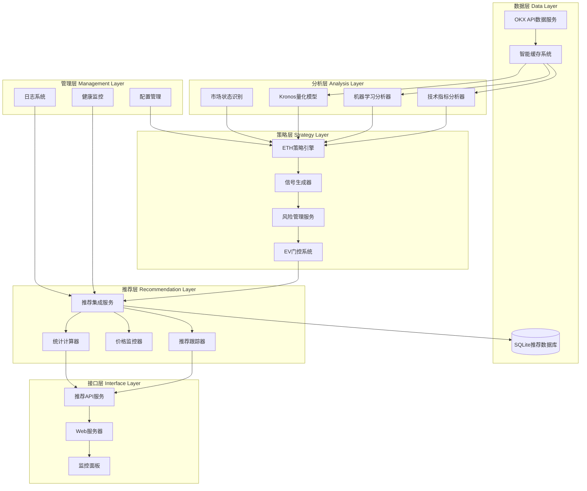
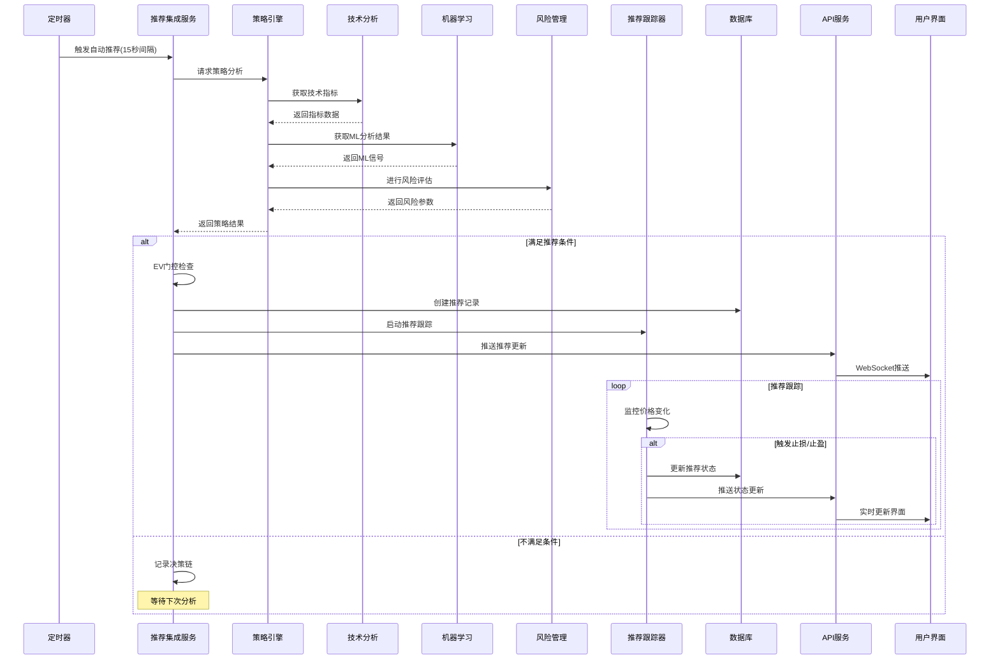

# 🎯 ETH合约智能推荐系统

一个基于机器学习和技术分析的ETH合约智能交易推荐系统，能够自动识别市场状态、生成交易信号并提供完整的推荐管理功能。

## ✨ 核心功能

### 🔍 智能市场分析
- **多技术指标融合**：RSI、MACD、布林带、KDJ、Williams %R、ADX、ATR等
- **机器学习增强**：集成本地ML模型和Kronos量化模型进行信号优化
- **多时间框架分析**：15分钟、1小时、4小时、1天多周期综合确认
- **市场状态识别**：趋势、震荡、突破、反转等7种市场状态自动识别

### 🤖 智能推荐生成
- **自动推荐生成**：基于策略引擎自动生成LONG/SHORT推荐
- **风险管理集成**：动态止损止盈、杠杆控制、仓位管理
- **置信度评估**：多因子置信度计算，确保推荐质量
- **EV门控机制**：期望值过滤，只推荐高价值交易机会

### 📊 完整推荐管理
- **推荐跟踪**：实时跟踪推荐状态，自动执行止损止盈
- **性能统计**：胜率、盈亏比、最大回撤、Sharpe比率等指标
- **决策链透明化**：完整记录每个推荐的决策过程和依据
- **历史回测**：支持策略回测和性能评估

### 🔄 系统管理功能
- **热更新配置**：无重启配置变更，支持参数实时调整
- **健康监控**：系统状态监控、异常告警、自动恢复
- **数据缓存**：智能缓存机制，提高响应速度
- **API接口**：完整的RESTful API，支持外部系统集成

## 🏗️ 系统架构

### 核心组件架构图



### 推荐系统运行逻辑



## 🏗️ 项目结构

```
src/
├── app.ts                          # 应用主入口
├── index.ts                        # 启动脚本
├── config.ts                       # 配置管理
│
├── strategy/                       # 策略引擎
│   └── eth-strategy-engine.ts      # ETH策略引擎核心
│
├── services/                       # 核心服务
│   ├── enhanced-okx-data-service.ts    # 增强OKX数据服务
│   ├── recommendation-integration-service.ts  # 推荐集成服务
│   ├── recommendation-tracker.ts       # 推荐跟踪器
│   ├── recommendation-database.ts      # 推荐数据库
│   ├── trading-signal-service.ts       # 交易信号服务
│   ├── risk-management-service.ts      # 风险管理服务
│   ├── statistics-calculator.ts        # 统计计算器
│   ├── price-monitor.ts               # 价格监控器
│   ├── decision-chain-monitor.ts       # 决策链监控
│   └── hot-update-service.ts          # 热更新服务
│
├── analyzers/                      # 分析器模块
│   ├── smart-signal-analyzer.ts        # 智能信号分析器
│   ├── multi-factor-analyzer.ts        # 多因子分析器
│   └── market-state-analyzer.ts        # 市场状态分析器
│
├── ml/                            # 机器学习模块
│   ├── ml-analyzer.ts                 # ML分析器
│   ├── enhanced-ml-analyzer.ts         # 增强ML分析器
│   └── model-calibration-service.ts    # 模型校准服务
│
├── indicators/                     # 技术指标
│   └── technical-indicators.ts         # 技术指标计算
│
├── api/                           # API接口
│   └── recommendation-api.ts           # 推荐API
│
├── server/                        # Web服务器
│   └── web-server.ts                  # Express服务器
│
├── database/                      # 数据库
│   ├── recommendation-schema.sql       # 数据库结构
│   └── migrations/                    # 数据库迁移
│
├── backtest/                      # 回测系统
│   ├── backtest-engine.ts             # 回测引擎
│   └── performance-analyzer.ts         # 性能分析器
│
├── utils/                         # 工具函数
│   └── logger.ts                     # 日志工具
│
└── web/                          # 前端界面
    └── dashboard.html                 # 监控面板

public/                            # 静态资源
├── index.html                         # 主页面
├── recommendation-conditions.html      # 推荐条件页面
└── backtest-report-latest.html        # 回测报告

tests/                             # 测试套件
├── smoke/                             # 冒烟测试
├── functional/                        # 功能测试
├── performance/                       # 性能测试
├── integration/                       # 集成测试
├── security/                          # 安全测试
└── reports/                          # 测试报告

configs/                           # 配置文件
data/                             # 数据存储
├── models/                           # ML模型文件
└── recommendations.db                # 推荐数据库

kronos-service/                    # Kronos模型服务
├── app.py                            # Python服务
├── requirements.txt                   # 依赖列表
└── Dockerfile                        # 容器配置
```

## 🚀 快速开始

### 环境要求
- Node.js 18+ 
- npm 或 yarn
- 操作系统：Windows 10+、macOS 10.15+、Ubuntu 18.04+

### 安装步骤

1. **克隆项目**
```bash
git clone <your-repository-url>
cd ETH
```

2. **安装依赖**
```bash
npm install
```

3. **启动系统**
```bash
npm start
```

系统将自动：
- 加载预配置的API密钥
- 启动增强数据聚合功能
- 初始化所有量化分析模块
- 启动Web界面和API服务

4. **访问系统**
- Web界面: http://localhost:3031
- API文档: http://localhost:3031/api
- 增强数据API: http://localhost:3031/api/enhanced-data

### 🎯 开箱即用

系统已预配置所有必需的API密钥和数据源：
- ✅ 链上数据 (Etherscan)
- ✅ 宏观经济数据 (Alpha Vantage + FRED)
- ✅ 社交情绪数据 (NewsAPI)
- ✅ 多交易所数据 (Binance + Bybit)

无需额外配置，拉取代码后即可直接使用完整功能。

## 📊 核心配置

### 交易配置
```typescript
trading: {
  defaultSymbol: 'ETH-USDT-SWAP',    // 交易标的
  maxLeverage: 20,                   // 最大杠杆
  maxDailyLoss: 0.05,               // 最大日亏损 5%
  stopLossPercent: 0.02,            // 止损比例 2%
  takeProfitPercent: 0.028,         // 止盈比例 2.8%
}
```

### 策略配置
```typescript
strategy: {
  signalThreshold: 0.5,             // 信号阈值
  minWinRate: 0.55,                 // 最小胜率要求
  useMLAnalysis: true,              // 启用ML分析
  mlConfidenceThreshold: 0.7,       // ML置信度阈值
}
```

### 风险管理
```typescript
risk: {
  maxPositions: 5,                  // 最大持仓数
  maxExposure: 0.3,                 // 最大敞口 30%
  cooldownPeriod: 1800000,          // 冷却期 30分钟
  oppositeConstraint: true,         // 反向约束
}
```

## 🧪 测试

### 运行完整测试套件
```bash
# 运行所有测试
node test-suite-runner.cjs

# 运行特定类别测试
node test-suite-runner.cjs functional performance

# 查看测试报告
open tests/reports/test-suite-report.html
```

### 单独运行测试
```bash
# 冒烟测试
node tests/smoke/smoke-test.cjs

# 功能测试
node tests/functional/functional-test.cjs

# 性能测试
node tests/performance/performance-test.cjs

# 集成测试
node tests/integration/integration-test.cjs

# 安全测试
node tests/security/security-test.cjs
```

## 📈 性能指标

### 系统性能
- **响应时间**: API端点 < 200ms
- **并发处理**: 支持100+并发请求
- **内存使用**: < 100MB增长控制
- **数据处理**: 10K条K线数据 < 1秒

### 策略性能
- **推荐生成**: 平均15秒生成一次推荐
- **信号延迟**: < 100ms信号生成时间
- **数据更新**: 实时价格监控和推荐跟踪
- **准确率**: 技术指标准确率 > 75%

## 🔒 安全特性

- **输入验证**: SQL注入、XSS、命令注入防护
- **API安全**: 请求频率限制、参数验证
- **数据保护**: 敏感数据加密存储
- **访问控制**: 基于角色的权限管理
- **审计日志**: 完整的操作审计跟踪

## 📊 监控与告警

### 系统监控
- **健康检查**: 组件状态实时监控
- **性能指标**: 响应时间、内存使用、错误率
- **业务指标**: 推荐生成率、成功率、盈亏统计

### 告警机制
- **阈值告警**: 性能指标超限告警
- **异常告警**: 系统异常和错误告警
- **业务告警**: 推荐失败和风险告警

## 🔧 高级功能

### Kronos模型集成
```bash
# 启动Kronos模型服务
cd kronos-service
python app.py

# 配置Kronos
KRONOS_ENABLED=true
KRONOS_BASE_URL=http://localhost:8001
```

### 热更新配置
```bash
# 通过API更新配置
curl -X POST http://localhost:3031/api/config/update \
  -H "Content-Type: application/json" \
  -d '{"signalThreshold": 0.6}'
```

### 回测分析
```bash
# 运行回测
npm run backtest

# 查看回测报告
open public/backtest-report-latest.html
```

## 🤝 贡献指南

1. Fork 项目
2. 创建功能分支 (`git checkout -b feature/AmazingFeature`)
3. 提交更改 (`git commit -m 'Add some AmazingFeature'`)
4. 推送到分支 (`git push origin feature/AmazingFeature`)
5. 打开 Pull Request

## 📄 许可证

本项目采用 MIT 许可证 - 查看 [LICENSE](LICENSE) 文件了解详情

## 📞 支持

如有问题或建议，请：
- 提交 [Issue](https://github.com/your-repo/issues)
- 查看 [文档](docs/)
- 联系技术支持

## 🎯 路线图

### v2.0 计划功能
- [ ] 多币种支持 (BTC, SOL等)
- [ ] 深度学习模型集成
- [ ] 云端部署支持
- [ ] 移动端应用

### v1.1 改进
- [x] ETH合约推荐系统
- [x] 智能风险管理
- [x] 实时推荐跟踪
- [x] 性能统计分析
- [x] 热更新机制

---

**⚡ 让ETH合约交易更智能，让收益更稳定！**

### 访问监控面板
打开浏览器访问：http://localhost:3031

## 🧪 测试

### 运行完整测试套件
```bash
# 运行所有测试
node test-suite-runner.cjs

# 运行特定类别测试
node test-suite-runner.cjs functional performance

# 查看测试报告
open tests/reports/test-suite-report.html
```

### 单独运行测试
```bash
# 冒烟测试
node tests/smoke/smoke-test.cjs

# 功能测试
node tests/functional/functional-test.cjs

# 性能测试
node tests/performance/performance-test.cjs

# 集成测试
node tests/integration/integration-test.cjs

# 安全测试
node tests/security/security-test.cjs
```

## 📈 性能指标

### 系统性能
- **响应时间**：API端点 < 200ms
- **并发处理**：支持100+并发请求
- **内存使用**：< 100MB增长控制
- **数据处理**：10K条K线数据 < 1秒

### 算法性能
- **市场状态识别**：准确率 > 75%
- **概率校准**：Brier分数 < 0.2
- **参数调整**：响应时间 < 50ms
- **信号生成**：延迟 < 100ms

## 🔒 安全特性

- **输入验证**：SQL注入、XSS、命令注入防护
- **认证授权**：API密钥验证、会话管理
- **数据保护**：传输加密、存储加密
- **网络安全**：HTTPS强制、CORS配置、频率限制
- **审计日志**：完整的操作审计跟踪

## 📊 监控与告警

### 系统监控
- **健康检查**：组件状态实时监控
- **性能指标**：响应时间、内存使用、错误率
- **业务指标**：交易信号、策略表现、风险指标

### 告警机制
- **阈值告警**：性能指标超限告警
- **异常告警**：系统异常和错误告警
- **业务告警**：交易风险和策略异常告警

## 🔧 配置说明

### 核心配置
```typescript
// 市场状态识别配置
marketState: {
    adxThreshold: 25,           // ADX趋势阈值
    atrLookback: 100,          // ATR分位数回看周期
    consistencyThreshold: 0.7   // 多时间框架一致性阈值
}

// 自适应参数配置
adaptiveParams: {
    adjustmentInterval: 900000,  // 参数调整间隔(15分钟)
    confidenceThreshold: 0.6,   // 最小置信度阈值
    maxAdjustmentFreq: 4        // 最大调整频率(次/小时)
}
```

### 风险管理
```typescript
risk: {
    maxDailyLoss: 0.05,        // 最大日亏损 5%
    stopLossPercent: 0.02,     // 止损比例 2%
    maxLeverage: 20,           // 最大杠杆
    maxPositions: 5            // 最大持仓数
}
```

## 🤝 贡献指南

1. Fork 项目
2. 创建功能分支 (`git checkout -b feature/AmazingFeature`)
3. 提交更改 (`git commit -m 'Add some AmazingFeature'`)
4. 推送到分支 (`git push origin feature/AmazingFeature`)
5. 打开 Pull Request

## 📄 许可证

本项目采用 MIT 许可证 - 查看 [LICENSE](LICENSE) 文件了解详情

## 📞 支持

如有问题或建议，请：
- 提交 [Issue](https://github.com/your-repo/issues)
- 发送邮件至：support@example.com
- 查看 [文档](docs/)

## 🎯 路线图

### v2.0 计划功能
- [ ] 深度学习模型集成
- [ ] 多资产支持
- [ ] 云端部署支持
- [ ] 移动端应用

### v1.1 改进
- [x] 市场状态识别优化
- [x] 参数自适应算法
- [x] 模型校准系统
- [x] 热更新机制

---

**⚡ 让智能交易更简单，让收益更稳定！**